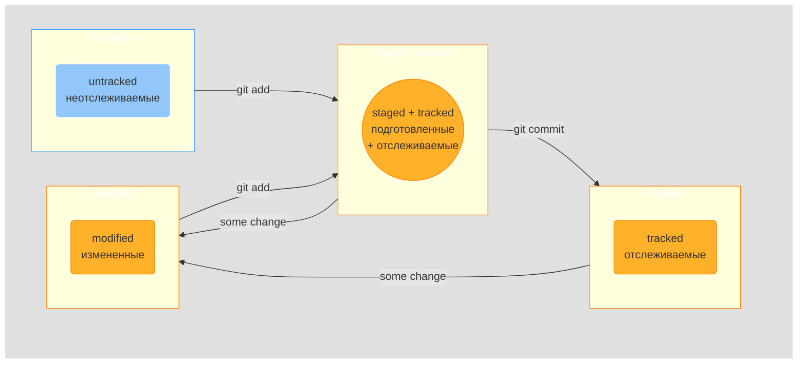

# **Как привязать локальный репозиторий к удаленному.**
---

## Локально:
### *В терминале* <br>
1. git init - инициализация папки проекта <br>
2. touch file name - создание файла <br>
3. git status - статус файлов проекта <br>
4. git add --all или (add .) - добавление файлов в репозиторий <br>
5. git commit -m 'Название коммита(осмысленное)' <br>
6. git log - история коммитов <br><br>


## Генерация SSH Key:

- .ssh/ проверка наличия ключей в корне(cd ~) <br><br>

- ssh-keygen -t ed25519 -C "YourEmailAddress@mail.com" генерация ключей в корне /C <br><br>

- получаем 2 ключа: <br>
id_ed25519 - приватный(не делиться не копировать)  id_ed25519.pub - публичный <br><br>


- .ssh/ проверка наличия ключей в корне(cd ~) <br><br>

- clip < ~/.ssh/id_ed25519.pub копируем ключь(публичный) <br><br>


## Удаленно:
### *Переходим на GitHub* <br>
- https://github.com/settings/keys / в меню слева выбираем: ssh and gpg keys <br> / новый SSH ключ / заполнить Title / тип ключа: Authentication key <br> / в поле Key - вставляем скопированный ключ <br><br>

- переходим в нужный репозиторий и копируем адрес репозитория <br><br>

## Локально:
### *В терминале* <br>
7. git remote add origin git@github.com:YourRepositoryName/GitTrain.git <br>
 привязываем удаленный репоз к локальному (из каталога локального реппозитроия) <br>
8. git remote -v - проверяем связь <br>
9. git push -u origin master - добавляем в ветку master (-u используется только первый раз) <br>
10. далее просто: git push <br><br>

---
<br><br>

## Команды в консоли.
### Навигация: <br>
- pwd (от англ. print working directory, «показать рабочую папку») — покажи, в какой я папке;<br>
- ls (от англ. list directory contents, «отобразить содержимое директории») — покажи файлы и папки в текущей папке;<br>
- ls -a — покажи также скрытые файлы и папки, названия которых начинаются с символа .;<br>
- cd first-project (от англ. change directory, «сменить директорию») — перейди в папку first-project;<br>
- cd first-project/html — перейди в папку html, которая находится в папке first-project;<br>
- cd .. — перейди на уровень выше, в родительскую папку;<br>
- cd ~ — перейди в домашнюю директорию (/Users/Username);<br>
- cd / — перейди в корневую директорию.<br><br>


# Файлы и папки.
---

## Работа с файлами и папками.
### Создание: <br>
- touch index.html (англ. touch, «коснуться») — создай файл index.html в текущей папке;<br>
- touch index.html style.css script.js — если нужно создать сразу несколько файлов, можно напечатать их имена в одну строку через пробел;<br>
- mkdir second-project (от англ. make directory, «создать директорию») — создай папку с именем second-project в текущей папке.<br><br>


### Копирование и перемещение: <br>
- cp file.txt ~/my-dir (от англ. copy, «копировать») — скопируй файл в другое место;<br>
- mv file.txt ~/my-dir (от англ. move, «переместить») — перемести файл или папку в другое место.<br>

### Чтение: <br>
- cat file.txt (от англ. concatenate and print, «объединить и распечатать») — распечатай содержимое текстового файла file.txt.<br>

### Удаление: <br>
- rm about.html (от англ. remove, «удалить») — удали файл about.html;<br>
- rmdir images (от англ. remove directory, «удалить директорию») — удали папку images;<br>
- rm -r second-project (от англ. remove, «удалить» + recursive, «рекурсивный») — удали папку second-project и всё, что она содержит.<br><br>


## Хеши:
- git log - история коммитов <br>
- git log --oneline - сокращенный лог(история коммитов)(max 72 символа) <br>
HEAD - указывает на последний коммит, можно передавать в качестве параметра в терминале. <br><br>

## Examples commits:
- Conventional Commits 
```html
 <type>: <messege>
 ``` 
```html
<type>
```
: feat - feature (for new functional), fix - исправить устранить - для исправления ошибок. <br>
- GitHub commit style: "Исправить задачу #354, добавить кнопку заказа" <br><br>

## Статусы файлов.




### Information for mermaid:

fill — заливка <br>
stroke — цвет границы <br>
stroke-width — толщина границы <br>
color — цвет текста <br>
stroke-dasharray — пунктирная граница <br>

<br><br>

## Изменить последний коммит.
### Дополнить коммит файлами:
git add <file name> - добавляем файлы <br>
git commit --amend --no-edit - дополнить коммит новыми файлами <br>
--no-edit сообщает о том, что сообщение коммита остается без изменений <br>
Изменения в файлах можно добавлять так же! <br>

### Изменить сообщение коммита:
git commit --amend -m'NEW MESSAGE' <br>
 

## Как откатиться назад.
Если сделал git add, но потом передумал: <br>
git restore --staged file name <br>

### Либо для всех файлов:
git restore --staged . <br>

### Откатить коммит:
git reset --hard commit hash - к которому нужно откатить <br>

### Откатить изменения которые не попали ни в staged ни в commit:
git restore file name - если изменил файл но не сделал git add <br>
(откат до последнего git add или git commit) <br>


## Просмотр изменений в файлах.
git diff - сравнивает последнюю закомиченную версию файла с текушей(измененной - modified) <br>

### Просмотр изменений в Staging area.
после команды git add - git diff не выводит ни чего <br>
нужно использовать git diff --staged <br>

### Дописать строку в файл:
echo "Any string" >> file.txt <br>

### Посмотреть содиржимое файла:
cat file name <br>


### Сравнить коммиты.
git diff <хэш 1коммита> <хэш 2коммита> - если наоборот то будет обратный порядок <br>


## Игнорирование файлов в Git - .gitignore(тоже нужно коммитить).
```HTML
# - комментарий

.file name - игнорирует файлы с именем .file name (в корне и вложенных папках)

*.jpeg - игнорирует все файлы заканчивающиеся на .jpeg

!item.jpeg - только не с именем item (item.jpeg не будет игнорироваться)

docs/*/tmp - игнорирует все файлы tmp во всех подпапках docs (docs/folder1/tmp)

docs/**/tmp - игнорирует docs/folder1/folder2/folder3/.../tmp

* - игнорирует все файлы

file?.txt - игнорирует file1.txt, file2.txt ... до file9.txt

file[0-2].txt - игнорирует file0.txt, file1.txt, file2.txt

/todo.txt - игнорирует todo.txt только в корневой дирректории(в других подпапках будет отслеживаться)

build/ - игнорирует папку build (если build - файл то он не будет игнорироваться)

git status --ignored - отобразить все игнорируемые файлы командой git status --ignored
```

**Выйти из редактора Vim:** нажать Esc, ввести :qa!, нажать Enter. <br>

---

[My Repository](https://github.com/AleksandrVakarin "Author Repository")

